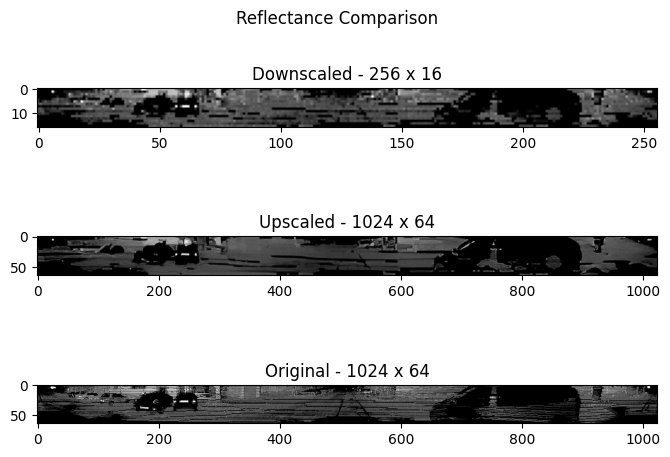
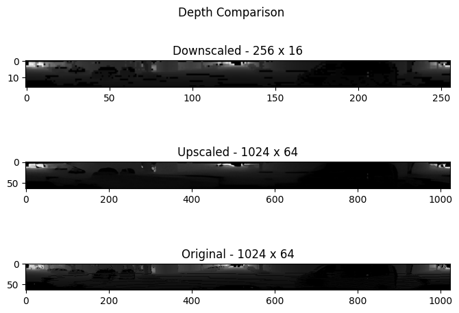
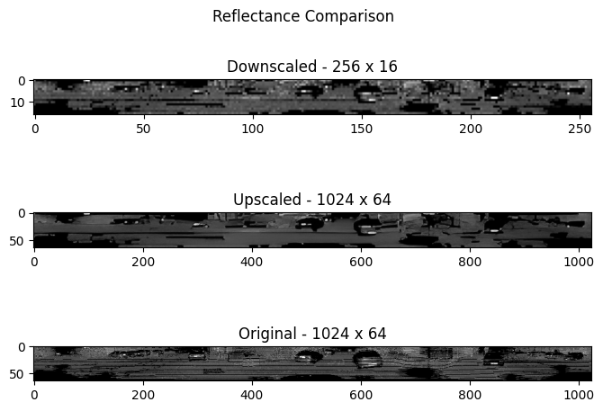
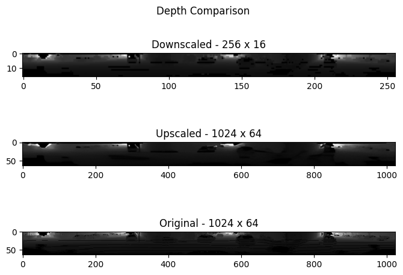

# Real-ESRGAN for Lidar Spherical Projections Images Finetune

This project aim to fine-tune the Real-ESRGAN model to handle low resolution images from lidar's spherical projection. We used Semantic Kitti dataset to finetuning the model.

## Repo Files

This repo contains the following files:

* Real_ESRGAN_architecture_finetune.ipynb. -- This file is used for training in order to define the parameters of the training process, like learning rate and validation frequncy.

* options/finetune_realesrgan_x4plus_architecture.yml -- This file is used for training in order to define the parameters of the training process, like learning rate and validation frequncy.

* realesrgan/train_finetune_architecture.py -- This is used to train new models.

* inference_realesrgan_architecture.py -- This file is used for inference or test trained networks.

* split_images.py -- This file is used to process and split images from 1024x16 to 256x16 dimension, setting the image with the right format for 4x upscaling.

* weigths/net_g_latest.pth -- The weigth provided from the finetune of real-esrgan with semantic kitti dataset. [Download link](https://drive.google.com/file/d/1B8iKdYACRmfTNgEd7FtWpCLHcTQemXUT/view?usp=sharing)

## Running The Code

To train the model in this git repo, one must first do these steps:

1. Download the original files from the Real-ESRGAN repo.
2. After downloading the files (Real-ESRGAN-master folder) to <your_dir>, add the files from this fine-tune repo in the Real-ESRGAN base folder in the exact folders they are in both reposetories i.e:
For all purposes
    * Real_ESRGAN_architecture_finetune.ipynb in the <your_dir>/Real-ESRGAN-master folder.
For training
    * finetune_realesrgan_x4plus_architecture.yml in the <your_dir>/Real-ESRGAN-master/options folder.
    * train_finetune_architecture.py in the <your_dir>/Real-ESRGAN-master/realesrgan folder.
For inference existing models
    * put the pre-trained models (.pth files) in the <your_dir>/Real-ESRGAN-master/weights folder. You can take our pre-trained model from here.

Open the Real_ESRGAN_architecture_finetune.ipynb file and from then you can run the code, needed explanations are in the notebook.

For more information, check the [original repo](https://github.com/xinntao/Real-ESRGAN)

## Image Quality Metrics 
- **SSIM (Structural Similarity Index)**: Evaluates the structural similarity between two images, ranging from -1 to 1, where 1 indicates identical images.
  
- **PSNR (Peak Signal-to-Noise Ratio)**: Metric that quantifies the relationship between the maximum signal of an image and the noise that affects image quality, calculates the mean squared error (MSE) between two images.
   - **High PSNR** values above 40 dB indicate visually imperceptible differences between the compared images. Values above 30 dB, generally indicates that the reconstructed image is very similar to the original image. Typically, is considered good quality, especially for 8-bit per channel images (Grayscale images). 
   - **Medium PSNR** values in range of 20 to 30 dB, suggests that there are some noticeable differences between the images, but the quality can be considered acceptable for some applications where visual precision is not critical, but it begins to show visible artifacts.
   - **Low PSNR** values below 20 dB indicates significant degradation in the quality of the reconstructed image.

## Results
To compare the upscaled images with the original high-resolution images:

|Image|Type|PSNR [dB]|SSIM|
|---|---|---|---|
|frame\_000054|depth|31\.604999152457196|0\.5728766932379483|
|frame\_000054|reflectance|29\.553471275023284|0\.25243974738916874|
|frame\_000124|depth|32\.09953274479659|0\.6007756677374365|
|frame\_000124|reflectance|28\.97276405985234|0\.20493032328551053|

### Semantic Kitti Sequence 01 - frame 0054

### Semantic Kitti Sequence 01 - frame 0124

